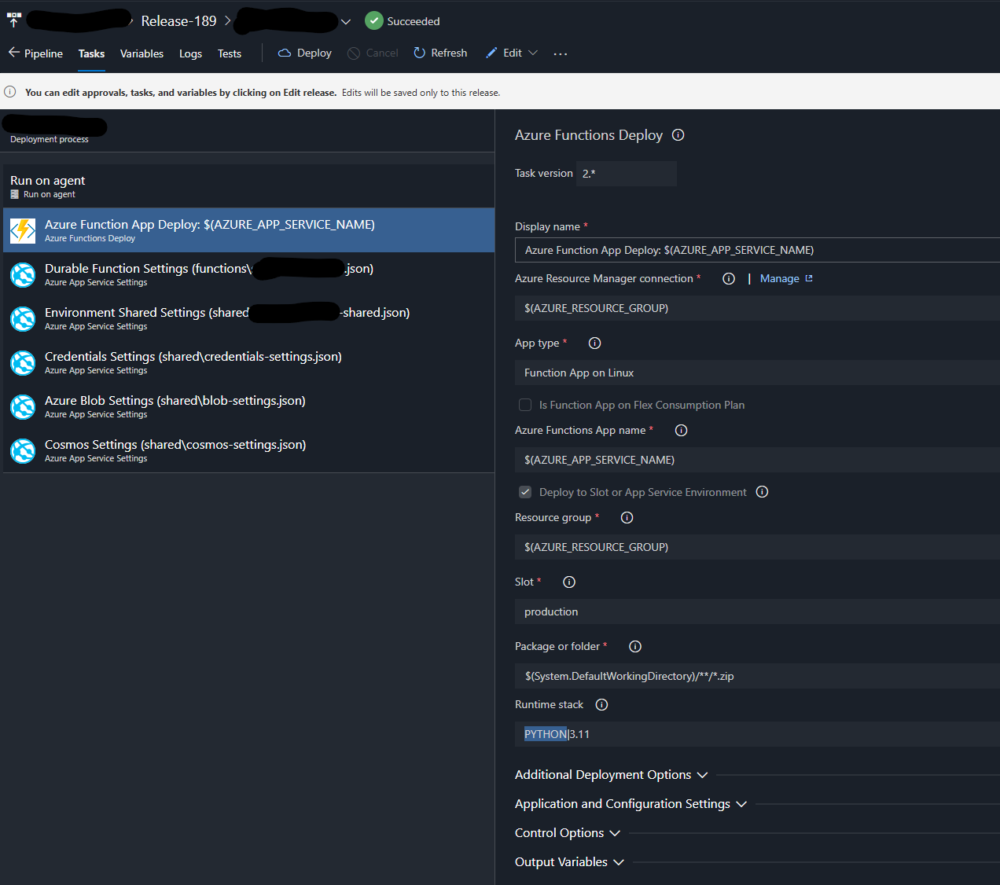
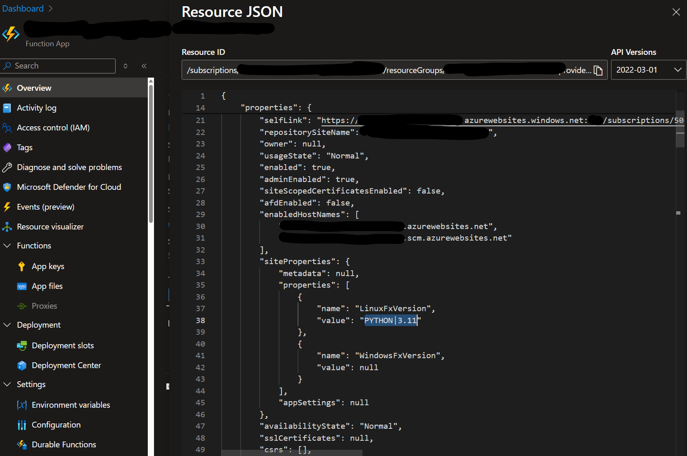

# Upgrade Runtime Version

Upgrading the Azure Function Application's Runtime version is not straightforward as it requires a new build, release
pipeline update, and an update to the Azure Function Application's configuration.
Before we start, let's get familiar with some terminologies:

1. **Runtime version**: The version of the Azure Functions runtime that is used by the Azure Function Application.
2. **Host version**: The version of the Azure Functions host that is used by the Azure Function Application.
3. **Language version**: The version of the programming language that is used by the Azure Function Application.
4. **SCM**: The Site Management System. It is the portal that is used to manage the Azure Function Application. Usually,
   accessible via `https://<function-app-name>.scm.azurewebsites.net`.

## Build Pipeline

The build pipeline is used to build the Azure Function Application. The build pipeline is configured to build the Azure
Function Application and it is crucial that the build runtime version matches the runtime version of the Azure Function
Application.

For example, the Python version here is `3.11`. If you are upgrading to Python `3.13`, you need to update the
`python.version` variable in the build pipeline.

```yaml
# Python Function App to Linux on Azure
# Build a Python function app and deploy it to Azure as a Linux function app.
# Add steps that analyze code, save build artifacts, deploy, and more:
# https://docs.microsoft.com/azure/devops/pipelines/languages/python

trigger:
  - main

variables:
  # Azure Resource Manager connection created during pipeline creation
  azureSubscription: 'your-azure-subscription-id'
  # Agent VM image name
  vmImageName: 'ubuntu-latest'
  #   Working Directory
  workingDirectory: $(System.DefaultWorkingDirectory)

  # ---- UV Configuration ----
  # These will be set as global environment variables
  UV_INDEX_SOMESOURCE_USERNAME: VssSessionToken
  UV_INDEX_SOMESOURCE_PASSWORD: $(System.AccessToken)
  # UV_KEYRING_PROVIDER: disabled
  # This environment variable keeps the cache in a predictable location
  UV_CACHE_DIR: $(Agent.TempDirectory)/cache/uv
  # Set Python Version
  python.version: '3.11' # Update this value to match the Python version of your application. --> '3.13'

stages:
  - stage: Build
    displayName: Build stage

    jobs:
      - job: Build
        displayName: Build
        pool:
          vmImage: $(vmImageName)
        steps:
          - bash: |
              if [ -f extensions.csproj ]
              then
                  dotnet build extensions.csproj --runtime ubuntu.16.04-x64 --output ./bin
              fi
            workingDirectory: $(workingDirectory)
            displayName: 'Build extensions'

          - task: UsePythonVersion@0
            inputs:
              versionSpec: '$(python.version)'
            displayName: 'Use Python $(python.version)'
# ....
```

## Release Pipeline

The release pipeline is used to deploy the Azure Function Application. The release pipeline is configured to deploy the
Azure Function Application and it is crucial that the release runtime version matches the runtime version of the Azure
Function Application.

For example, the Python version here is `3.11`. If you are upgrading to Python `3.13`, you will need to update thiis
variable to `PYTHON|3.13` variable in the release pipeline.

!!! note
Not every Python Runtime stack is listed in the dropdown. You can find the full list of Python Runtime stacks.
It is okay to manually type in the runtime stack if it is not listed. For more information go
here [linuxFxVersion](https://learn.microsoft.com/en-us/azure/azure-functions/functions-app-settings#linuxfxversion).



## LinuxFxVersion

The [LinuxFxVersion](https://learn.microsoft.com/en-us/azure/azure-functions/functions-app-settings#linuxfxversion) is
the configuration setting used to specify the runtime version of the Azure Function
Application. For example, `PYTHON|3.11` specifies that the
runtime stack is Python and the version is `3.11`. The following screenshot shows the `LinuxFxVersion` setting in the
SCM.


To pin the runtime version, you can update the `LinuxFxVersion` setting
via [Azure CLI](https://learn.microsoft.com/en-us/cli/azure/functionapp/config?view=azure-cli-latest):

```PowerShell
az functionapp config set --name <FUNCTION_APP_NAME> --resource-group <RESOURCE_GROUP_NAME> --linux-fx-version '"PYTHON|3.13"'
```
